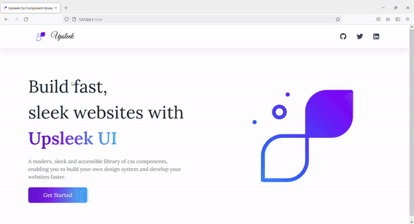

# Sleek  UI
Sleek  UI is a CSS component library that will help you to build your websites faster.


## Demo



## Installation
To use Sleek  UI add the following link in the head tag of your HTML document.
```
  <link rel="stylesheet" href="https://Sleek -ui.vercel.app/css/style.css">
```
    

## Documentation
[Documentation](https://Sleek -ui.vercel.app/docs/)


## Features
Following CSS components are provided in the component library:
- Avatar
- Alert
- Badge
- Button
- Card
- Image
- Input
- Text Utilities
- Lists
- Modal
- Simplified Grid
- Navbar

